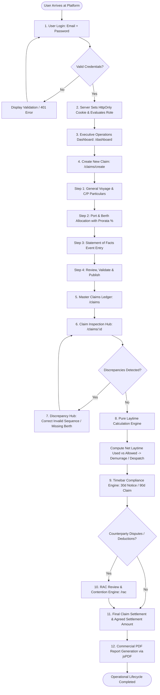

# Complete End-to-End Business Workflow

This document traces the exact end-to-end operational and commercial workflow implemented in the Laytime & Demurrage system.

---

## 1. End-to-End Process Flowchart

---

## 2. Granular Step-by-Step Execution

### Step 1: User Authentication & Role Verification
- **Input**: Corporate Email (`email`) and Password (`password`).
- **Processing**: Client checks email regex and minimum password length. Server verifies bcrypt hash from SQLite `users` table via `comparePassword()`. Signs 7-day JWT and writes secure HTTP-Only cookie `laytime_auth_token`.
- **Output**: User object without password hash, redirected to `/dashboard`.
- **Database Interaction**: `SELECT * FROM users WHERE LOWER(email) = LOWER(?)`.
- **User Roles**: Admin, Claim Processor, Supervisor, Reviewer.
- **Relevant Files**: [app/login/page.tsx](file:///C:/Lay%20time/app/login/page.tsx), [app/api/auth/login/route.ts](file:///C:/Lay%20time/app/api/auth/login/route.ts), [lib/auth/session.ts](file:///C:/Lay%20time/lib/auth/session.ts).
- **Validation**: Regex `/^[^\s@]+@[^\s@]+\.[^\s@]+$/`, non-empty password, active status check.
- **Error Handling**: `400 Bad Request` for format errors, `401 Unauthorized` for bad credentials, `403 Forbidden` for inactive accounts.

---

### Step 2: Operations Dashboard Intelligence
- **Input**: Query parameters (filter by client, claim status, claim type, date range).
- **Processing**: Aggregates total demurrage owed, received, exposure, and amount under contention. Groups claims into Recharts visual models.
- **Output**: Real-time KPI summary cards, status donut chart, financial trend area chart, and counterparty horizontal bar chart.
- **Database Interaction**: `SELECT * FROM claims`, aggregates metrics dynamically in [lib/mock/aggregate.ts](file:///C:/Lay%20time/lib/mock/aggregate.ts) and [lib/db/queries.ts](file:///C:/Lay%20time/lib/db/queries.ts).
- **User Roles**: Accessible to all roles.
- **Relevant Files**: [app/dashboard/page.tsx](file:///C:/Lay%20time/app/dashboard/page.tsx), [components/ui/kpi-card.tsx](file:///C:/Lay%20time/components/ui/kpi-card.tsx).

---

### Step 3: Multi-Step Claim Creation Wizard (`/claims/create`)
- **Step 1 — General Particulars**:
  - *Input*: Claim Title, Vessel Name, Account Name, Broker, CP Form (`BPVOY4`, `SHELLVOY6`, `ASBATANKVOY`, `GENCON`), Demurrage Daily Rate ($), Notice Timebar Days (default 30), Claim Timebar Days (default 90).
  - *Validation*: React Hook Form + Zod schema validation.
- **Step 2 — Ports & Berths**:
  - *Input*: Port Name, Port Type (`Load Port`, `Discharge Port`), Load Rate (MT/Day), Berth Name, Cargo Quantity (MT), Prorata Share (%).
  - *Processing*: Calculates allowed days: `Quantity / Load Rate`.
- **Step 3 — Statement of Facts (SoF)**:
  - *Input*: Activity Name (`NOR tendered`, `All fast`, `Discharging commenced`, `Rain delay`, `Shore crane breakdown`), Start Datetime, Stop Datetime, Percentage Counted (0% to 100%), Prorata (%), Deduction Category.
  - *Processing*: Derives gross duration in minutes.
- **Step 4 — Review & Publish**:
  - *Output*: Validated claim record committed to database.
- **Database Interaction**: `INSERT INTO claims ...`, `INSERT INTO ports ...`, `INSERT INTO berths ...`, `INSERT INTO statement_of_facts ...`.
- **User Roles**: Admin, Supervisor, Claim Processor (Reviewer is blocked).
- **Relevant Files**: [app/claims/create/page.tsx](file:///C:/Lay%20time/app/claims/create/page.tsx), [components/claims/Step1General.tsx](file:///C:/Lay%20time/components/claims/Step1General.tsx), [components/claims/Step2PortsBerths.tsx](file:///C:/Lay%20time/components/claims/Step2PortsBerths.tsx), [components/claims/Step3SoF.tsx](file:///C:/Lay%20time/components/claims/Step3SoF.tsx), [components/claims/Step4Review.tsx](file:///C:/Lay%20time/components/claims/Step4Review.tsx).

---

### Step 4: Discrepancy Detection & Data Audit
- **Input**: Array of Statement of Facts activities and Port/Berth definitions.
- **Processing**: [lib/calculations/discrepancies.ts](file:///C:/Lay%20time/lib/calculations/discrepancies.ts) executes deterministic checks:
  1. Unassigned / missing berths
  2. Unlinked ports
  3. Start timestamp strictly after stop timestamp
  4. Sequence violations (e.g. Discharging commencing prior to NOR tender)
  5. Impossibly long durations (>30 consecutive days)
  6. Low OCR confidence extractions (<80%)
- **Output**: Array of typed `Discrepancy` objects with severity (`error`, `warning`) and suggested corrections.
- **Database Interaction**: Inserted/queried from `discrepancies` table.
- **User Roles**: All users can view discrepancies; only Admin, Supervisor, and assigned Processor can resolve.

---

### Step 5: Hierarchical Laytime & Demurrage Calculation
- **Input**: Claim record, port records, berth records, and SoF activities.
- **Processing Sequence**:
  1. **Berth Level**:
     $$\text{Allowed Laytime (Minutes)} = \left(\frac{\text{Quantity}}{\text{Load Rate}}\right) \times 24 \times 60$$
     $$\text{Counted Minutes} = \text{Gross Minutes} \times \left(\frac{\text{Percentage Counted}}{100}\right) \times \left(\frac{\text{Prorata}}{100}\right)$$
     $$\text{Deduction Minutes} = \text{Gross Minutes} - \text{Counted Minutes}$$
     $$\text{Time Exceeded (Demurrage Minutes)} = \max(0, \text{Net Laytime Used} - \text{Allowed Laytime})$$
     $$\text{Time Saved (Despatch Minutes)} = \max(0, \text{Allowed Laytime} - \text{Net Laytime Used})$$
  2. **Port Level**: Aggregates berths belonging to the port.
  3. **Claim Master Level**: Sums port demurrage and despatch amounts to derive `finalPayableAmount`.
- **Output**: Complete `ClaimCalculation` object with berth breakdowns, port summaries, and timebar status.
- **Relevant Files**: [lib/calculations/laytime.ts](file:///C:/Lay%20time/lib/calculations/laytime.ts), [components/claims/ClaimCalculationsTab.tsx](file:///C:/Lay%20time/components/claims/ClaimCalculationsTab.tsx).

---

### Step 6: Contractual Timebar Evaluation
- **Input**: `voyageEndDate`, `noticeReceivedDate`, `claimReceivedDate`, `noticeTimebarDays`, `claimTimebarDays`.
- **Processing**:
  $$\text{Notice Deadline} = \text{Voyage End Date} + (\text{Notice Days Allowed} \times 24 \times 60 \times 60 \times 1000)$$
  $$\text{Claim Deadline} = \text{Voyage End Date} + (\text{Claim Days Allowed} \times 24 \times 60 \times 60 \times 1000)$$
  Computes remaining days and assigns alarm level: `Normal` (>25d), `Approaching` (11-25d), `Critical` (1-10d), `Expired` (<=0d or late submission).
- **Output**: Visual compliance timeline badge with timebarred indicator flag.
- **Relevant Files**: [lib/calculations/timebar.ts](file:///C:/Lay%20time/lib/calculations/timebar.ts), [app/timebar/page.tsx](file:///C:/Lay%20time/app/timebar/page.tsx).

---

### Step 7: RAC Review & Claim Contention Management
- **Input**: Disputed deductions, counterparty contentions, tariff adjustments.
- **Processing**: Evaluates recoverable claims through configurable formulas: gross categories sum, grace period allowance deductions, counterparty agreed deductibles, manual adjustment offsets, and prorata distribution factors.
- **Output**: Verified RAC calculation record with status tracking (`Draft`, `Submitted`, `Under Review`, `Correction Required`, `Reviewed`, `Closed`).
- **Relevant Files**: [lib/rac/calculations.ts](file:///C:/Lay%20time/lib/rac/calculations.ts), [app/rac/page.tsx](file:///C:/Lay%20time/app/rac/page.tsx), [app/rac/cases/[id]/page.tsx](file:///C:/Lay%20time/app/rac/cases/%5Bid%5D/page.tsx).

---

### Step 8: PDF Report Generation & Export
- **Input**: Active claim particulars and calculation results.
- **Processing**: `jsPDF` creates vector document with maritime header, commercial metadata table, financial & timebar summary, port & berth breakdown, itemized Statement of Facts timeline, and signature block.
- **Output**: Formatted `.pdf` file downloaded directly to the user's browser.
- **Relevant Files**: [lib/utils/exportPdf.ts](file:///C:/Lay%20time/lib/utils/exportPdf.ts), [app/reports/page.tsx](file:///C:/Lay%20time/app/reports/page.tsx).
