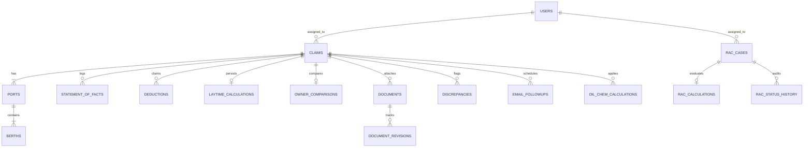

# Database Architecture & Relational Schema Documentation

## 1. Database Overview

The primary active database for the application is an embedded, file-backed relational SQLite3 database located at:
```
data/laytime.db
```
Managed by `better-sqlite3` ([lib/db/index.ts](file:///C:/Lay%20time/lib/db/index.ts)), the engine is configured with:
- **Write-Ahead Logging**: `PRAGMA journal_mode = WAL;` (high concurrent read throughput).
- **Foreign Key Enforcement**: `PRAGMA foreign_keys = ON;` (referential integrity cascades).
- **Busy Timeout**: `PRAGMA busy_timeout = 5000;` (prevents lock contention errors).

*(Note: An enterprise PostgreSQL schema is also mirrored in [backend/prisma/schema.prisma](file:///C:/Lay%20time/backend/prisma/schema.prisma) for the optional standalone NestJS backend).*

---

## 2. Entity-Relationship (ER) Overview



---

## 3. Comprehensive Table Catalog

### 1. `users` Table
Stores operational team members, credentials, and access roles.

| Column | Data Type | Constraints | Description |
| :--- | :--- | :--- | :--- |
| `id` | TEXT | PRIMARY KEY | Unique identifier (`usr-001`, `usr-<timestamp>`) |
| `name` | TEXT | NOT NULL | Full operational user name |
| `email` | TEXT | NOT NULL, UNIQUE | Corporate login email address |
| `username` | TEXT | UNIQUE | System login handle |
| `password_hash` | TEXT | NOT NULL | Blowfish bcrypt hash digest |
| `role` | TEXT | NOT NULL, CHECK in (`Admin`, `Claim Processor`, `Supervisor`, `Reviewer`) | Authorization role |
| `avatar` | TEXT | NULLABLE | Profile picture image URI |
| `status` | TEXT | NOT NULL, DEFAULT 'Active', CHECK in (`Active`, `Inactive`) | Account state |
| `role_description` | TEXT | NULLABLE | Role scope description |
| `created_at` | TEXT | NOT NULL | ISO 8601 creation timestamp |
| `updated_at` | TEXT | NOT NULL | ISO 8601 update timestamp |

---

### 2. `claims` Table
Core master ledger entity storing voyage particulars, counterparties, commercial terms, and financial amounts.

| Column | Data Type | Constraints | Description |
| :--- | :--- | :--- | :--- |
| `id` | TEXT | PRIMARY KEY | Unique claim ID (e.g. `CLM-2024-001`) |
| `claim_name` | TEXT | NOT NULL | Descriptive title of claim |
| `account_name` | TEXT | NOT NULL | Commercial client account (e.g. `Trafigura`) |
| `broker_name` | TEXT | NOT NULL | Intermediary chartering broker |
| `claim_status` | TEXT | NOT NULL, DEFAULT 'Submitted' | `Submitted`, `Incomplete`, `Review`, `Settled`, `Disputed`, `Timebarred` |
| `claim_type` | TEXT | NOT NULL | `Load Port Demurrage`, `Discharge Port Demurrage`, `Combined Demurrage`, `Despatch`, `Detention` |
| `ship_name` | TEXT | NOT NULL | Ocean vessel name |
| `cp_type` | TEXT | NOT NULL | Charter Party form (`BPVOY4`, `SHELLVOY6`, `ASBATANKVOY`, `GENCON`, `NYPE`, `BIMCO`) |
| `voyage_number` | TEXT | NULLABLE | Voyage contract reference |
| `assigned_to` | TEXT | NOT NULL | Assigned Demurrage Analyst name/email |
| `days_open` | INTEGER | NOT NULL, DEFAULT 0 | Elapsed days since inception |
| `claim_closed` | INTEGER | NOT NULL, DEFAULT 0 | 1 if settled/closed, 0 if active |
| `contentions` | TEXT | NULLABLE | Counterparty dispute summary |
| `claim_notes` | TEXT | NULLABLE | Internal operational notes |
| `document_links` | TEXT | NULLABLE | JSON array of associated document files |
| `demurrage_rate_per_day` | REAL | NOT NULL, DEFAULT 0 | Daily contractual rate in USD |
| `counterparty_name` | TEXT | NULLABLE | Opposing chartering entity |
| `counterparty_type` | TEXT | NULLABLE | `Owner`, `Charterer`, `Trader`, `Receiver`, `Shipper` |
| `claim_filed_amount` | REAL | NOT NULL, DEFAULT 0 | Initial claimed demurrage amount ($) |
| `received_claim_amount` | REAL | DEFAULT 0 | Cash amount received |
| `agreed_amount` | REAL | DEFAULT 0 | Final mutually agreed settlement amount ($) |
| `billable_amount` | REAL | DEFAULT 0 | Net invoiceable demurrage ($) |
| `payment_received` | REAL | DEFAULT 0 | Recorded payment amount |
| `payment_concluded` | INTEGER | NOT NULL, DEFAULT 0 | Payment closure boolean flag |
| `layday` | TEXT | NULLABLE | Earliest contractual layday date |
| `cancelling_date` | TEXT | NULLABLE | Cancelling date (laycan deadline) |
| `voyage_end_date` | TEXT | NULLABLE | Date vessel completed voyage operations |
| `instruction_received_date` | TEXT | NULLABLE | Date claim instructions were delivered |
| `notice_received_date` | TEXT | NULLABLE | Date formal Notice of Demurrage was tendered |
| `claim_received_date` | TEXT | NULLABLE | Date formal claim package was received |
| `notice_timebar_days` | INTEGER | DEFAULT 30 | Contractual notice timebar limit (typically 30d) |
| `claim_timebar_days` | INTEGER | DEFAULT 90 | Contractual claim timebar limit (typically 90d) |
| `timebarred` | INTEGER | NOT NULL, DEFAULT 0 | 1 if legally timebarred, 0 if compliant |
| `claim_agreed_date` | TEXT | NULLABLE | Settlement execution date |
| `charterparty_date` | TEXT | NULLABLE | Charter party contract date |
| `days_awaiting_payment` | INTEGER | DEFAULT 0 | Age of undisputed outstanding balance |
| `created_at` | TEXT | NOT NULL | ISO 8601 creation timestamp |
| `updated_at` | TEXT | NOT NULL | ISO 8601 update timestamp |

---

### 3. `ports` Table
Ports visited during the claim voyage.
- `id` (TEXT, PK): Port identifier.
- `claim_id` (TEXT, FK -> `claims.id` ON DELETE CASCADE).
- `name` (TEXT, NOT NULL): Port name (e.g. `Port of Rotterdam`).
- `port_type` (TEXT, NOT NULL): `Load Port` or `Discharge Port`.
- `load_rate` (REAL, NOT NULL): Default contractual handling rate (Metric Tons / Day).
- `created_at` (TEXT, NOT NULL).

---

### 4. `berths` Table
Individual cargo berths at each port.
- `id` (TEXT, PK): Berth identifier.
- `port_id` (TEXT, FK -> `ports.id` ON DELETE CASCADE).
- `name` (TEXT, NOT NULL): Terminal/Berth name (e.g. `Vopak EuroTank 4`).
- `quantity` (REAL, NOT NULL): Cargo quantity handled (MT).
- `prorata_share` (REAL, NOT NULL, DEFAULT 100): Percentage share for multi-receiver cargoes.
- `is_prorata_overridden` (INTEGER, NOT NULL, DEFAULT 0).
- `load_rate` (REAL, NOT NULL): Berth-specific handling rate (MT/Day).
- `cargo_type` (TEXT, NULLABLE): Handled commodity (e.g. `Crude Oil`).
- `receiver_name` (TEXT, NULLABLE): Designated cargo receiver.

---

### 5. `statement_of_facts` Table
Itemized chronological event log for laytime calculation.
- `id` (TEXT, PK).
- `claim_id` (TEXT, FK -> `claims.id` ON DELETE CASCADE).
- `port_id` (TEXT, NULLABLE).
- `berth_id` (TEXT, NULLABLE).
- `activity_name` (TEXT, NOT NULL): E.g., `NOR tendered`, `All fast`, `Rain delay`.
- `start_time` (TEXT, NOT NULL): ISO 8601 datetime.
- `stop_time` (TEXT, NOT NULL): ISO 8601 datetime.
- `duration_minutes` (INTEGER, NOT NULL, DEFAULT 0).
- `duration_formatted` (TEXT, NOT NULL): Human-readable duration (`04h 30m`).
- `percentage_counted` (REAL, NOT NULL, DEFAULT 100): Allowable percentage (0% to 100%).
- `prorata` (REAL, NOT NULL, DEFAULT 100): Prorata factor.
- `deduction_category` (TEXT, NOT NULL): E.g., `Weather Delay`, `Shore Breakdown`, `Waiting for berth`.
- `remarks` (TEXT, NULLABLE): Analytical notes.
- `is_ocr_extracted` (INTEGER, NOT NULL, DEFAULT 0).
- `is_corrected` (INTEGER, NOT NULL, DEFAULT 0).
- `ocr_confidence` (REAL, DEFAULT 1.0).
- `original_ocr_values` (TEXT, NULLABLE): JSON string of raw OCR text before manual edit.

---

### 6. `laytime_calculations` Table
Persisted mathematical calculation snapshot.
- `id` (TEXT, PK).
- `claim_id` (TEXT, UNIQUE, FK -> `claims.id` ON DELETE CASCADE).
- `demurrage_rate_per_day` (REAL, NOT NULL).
- `total_gross_minutes` (INTEGER, NOT NULL).
- `total_deductions_minutes` (INTEGER, NOT NULL).
- `total_net_laytime_minutes` (INTEGER, NOT NULL).
- `total_allowed_minutes` (INTEGER, NOT NULL).
- `net_demurrage_minutes` (INTEGER, NOT NULL).
- `net_despatch_minutes` (INTEGER, NOT NULL).
- `calculated_demurrage_amount` (REAL, NOT NULL).
- `calculated_despatch_amount` (REAL, NOT NULL).
- `final_payable_amount` (REAL, NOT NULL).
- `port_calculations_json` (TEXT, NOT NULL): JSON serialized array of port calculations.
- `timebar_compliance_json` (TEXT, NULLABLE): JSON serialized timebar status.
- `assumptions_json` (TEXT, NULLABLE): Calculation parameters snapshot.
- `calculated_by` (TEXT, NULLABLE).
- `calculated_at` (TEXT, NOT NULL).

---

### 7. Additional Specialized Tables
- **`owner_comparisons`**: Stores side-by-side differentials between Owner claims and Charterer internal calculations (`difference_amount`, `difference_hours`, `explanation`).
- **`documents` & `document_revisions`**: File records, categories (`SoF`, `Charter Party`, `NOR`, `Timesheet`), versions, and OCR confidence ratings.
- **`discrepancies`**: Operational anomalies, type (`missing_berth`, `invalid_date`, `time_overlap`), severity (`error`, `warning`), suggested correction, and resolution audit.
- **`notifications`**: Real-time user alerts for timebar warnings, missing docs, and supervisor review requirements.
- **`email_followups`**: Scheduled chasers and payment follow-up logs with templates.
- **`incoming_emails`**: Inbound counterparty emails and correspondence queue.
- **`oil_chem_calculations`**: ASTM 54B VCF factors, corrected densities, pumping warranty hours, and excess pumping demurrage.
- **`timesheet_imports`**: Parsed spreadsheet timesheet rows waiting for analyst approval.
- **`business_rules`**: Global system parameters stored as JSON key-value pairs.
- **`rac_cases`**, **`rac_calculations`**, **`rac_status_history`**: Recoverable Adjustment Claim entities, parameters, formula breakdowns, and status transitions.
