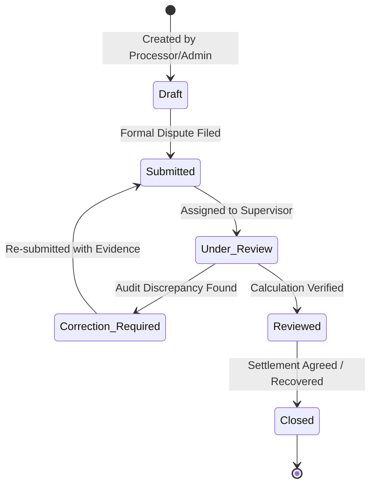

# Recoverable Adjustment Claims (RAC) Engine

This document details the architecture, data models, calculation engine, and lifecycle of the **RAC (Recoverable Adjustment Claims)** module.

---

## 1. Business Meaning & Purpose of RAC

In maritime demurrage accounting, charterers and owners frequently encounter disputed deductions that cannot be immediately reconciled on the primary voyage timesheet:
- Contested shore crane mechanical breakdowns vs. bad weather exceptions.
- Unsubstantiated pumping pressure slowdowns claimed by charterers.
- Pilotage delays or port authority waiting hours billed as charterer's account.

Rather than delaying the settlement of the undisputed portion of a multi-million-dollar voyage claim, commercial teams establish a **Recoverable Adjustment Claim (RAC)** case. The RAC module acts as a dedicated sub-ledger and dispute management engine to track, calculate, document, and negotiate disputed recovery balances.

---

## 2. RAC Status Lifecycle

A RAC case progresses through a strict 6-stage operational state machine:

### Supported Status Definitions:
1. **`Draft`**: Case initiated by Demurrage Analyst; documentation being compiled.
2. **`Submitted`**: Case formally presented to counterparty / internal review board.
3. **`Under Review`**: Supervisor or Legal Reviewer examining supporting evidence.
4. **`Correction Required`**: Inconsistencies flagged in tariff rates or duration.
5. **`Reviewed`**: Calculation audited and approved by authorized supervisor.
6. **`Closed`**: Recovery funds received or commercial compromise concluded.

---

## 3. Configurable Calculation Engine

The calculation engine is implemented as a pure, deterministic function in [lib/rac/calculations.ts](file:///C:/Lay%20time/lib/rac/calculations.ts) (`computeRacCalculation`):

### 6-Step Calculation Sequence:
1. **Base Gross Evaluation**:
   - If itemized cost categories exist:
     $$\text{Gross} = \sum_{k} \left(\text{Unit Cost}_k \times \text{Quantity}_k \times \left(1 - \frac{\text{Deductible}\%_k}{100}\right)\right)$$
   - Else if actual incurred cost is provided: $\text{Gross} = \text{Actual Incurred Invoice Cost}$.
   - Else: $\text{Gross} = \text{Quantity or Duration} \times \text{Agreed Daily/Hourly Rate}$.
2. **Contractual Grace Allowance Deduction**:
   $$\text{Grace Deduction} = \text{Grace Allowance Hours} \times \left(\frac{\text{Agreed Rate}}{24}\right)$$
3. **Counterparty Baseline Allowance**: Subtracts contractual agreed deductibles.
4. **Itemized Adjustments Sum**: Applies positive (surcharges) or negative (credits) manual adjustments.
5. **Prorata Factor**: Multiplies intermediate subtotal by fractional parcel share (`prorataFactor`).
6. **Tax / VAT Surcharge**: Applies jurisdictional VAT/Tax percentage:
   $$\text{Tax Amount} = \text{Subtotal} \times \left(\frac{\text{Tax}\%}{100}\right)$$
   $$\mathbf{Final\ Recoverable\ RAC\ Claim} = \max(0, \text{Subtotal} + \text{Tax Amount})$$

---

## 4. UI & API Integration

- **Overview Dashboard (`/rac`)**: Displays total RAC cases, portfolio recoverable value ($), recovered amounts, and pending cases.
- **RAC Case Directory (`/rac/cases`)**: Searchable, filterable ledger of all active cases.
- **Detailed Case Hub (`/rac/cases/:id`)**: Comprehensive view providing rule parameter editing, interactive adjustment logs, formula breakdown step inspector, and PDF generation.
- **Interactive Calculator (`/rac/calculations`)**: Standalone tariff and formula testing sandbox.
- **API Handlers**:
  - `GET /api/rac/cases`: Filter by status, client, claim ID.
  - `POST /api/rac/cases`: Create case (Reviewer blocked).
  - `GET /api/rac/cases/:id`: Detailed case particulars.
  - `PUT /api/rac/cases/:id`: Update case (Claim Processor restricted to assigned).
  - `DELETE /api/rac/cases/:id`: Admin/Supervisor only.
  - `POST /api/rac/calculations`: Run configurable RAC calculation engine.
