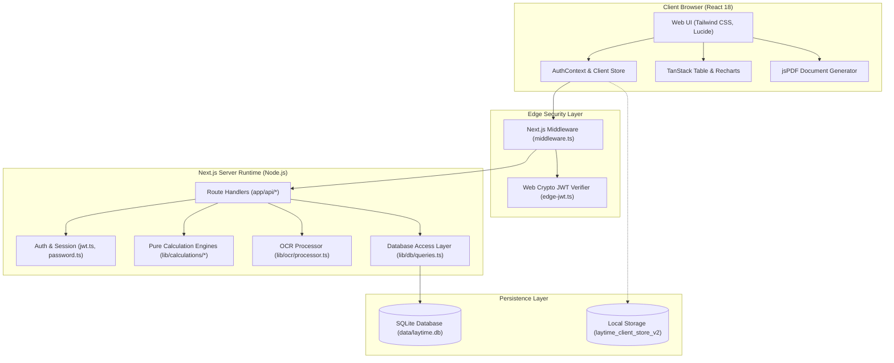

# System Architecture Documentation

## 1. High-Level Architecture Overview

The system employs a full-stack, decoupled architecture built on **Next.js 14 App Router**. It unifies presentation, API routing, calculation execution, and database persistence into a high-performance, single-repository solution.

---

## 2. Layer-by-Layer Architectural Breakdown

### Layer 1: Presentation & Layout Architecture
- **Root Layout ([app/layout.tsx](file:///C:/Lay%20time/app/layout.tsx))**: Injects global CSS styles, Inter fonts, and wraps all views inside the global `AuthProvider`.
- **Application Shell ([components/layout/AppShell.tsx](file:///C:/Lay%20time/components/layout/AppShell.tsx))**: Dynamically switches between the clean unauthenticated login viewport and the full desktop/mobile operational layout with persistent Sidebar and Header.
- **Responsive Sidebar ([components/layout/Sidebar.tsx](file:///C:/Lay%20time/components/layout/Sidebar.tsx))**: Contains the 12 primary navigation channels with collapsible drawer functionality, real-time unread notification badge counters, and user role profile display.
- **Operational Header ([components/layout/Header.tsx](file:///C:/Lay%20time/components/layout/Header.tsx))**: Features global claim search input, live role indicator badge, real-time notification drop-down, and user profile/logout actions.

### Layer 2: Edge Security & Route Protection
- **Middleware ([middleware.ts](file:///C:/Lay%20time/middleware.ts))**: Runs on the Next.js Edge runtime before requests reach page renderers or API handlers.
  - Extracts the HTTP-Only cookie `laytime_auth_token`.
  - Verifies HMAC-SHA256 signature using native Web Crypto (`crypto.subtle`) in [lib/auth/edge-jwt.ts](file:///C:/Lay%20time/lib/auth/edge-jwt.ts).
  - Unauthenticated access to protected routes (`/dashboard`, `/claims`, `/timebar`, `/users`, etc.) triggers a `307` redirect to `/login?from=<requested_url>`.
  - Enforces role-based route gatekeeping: only authenticated users with the `Admin` role can access `/users`. Non-admins are redirected to `/dashboard`.
  - Injects `Cache-Control: no-store, must-revalidate` response headers on all authenticated pages to prevent browser back-button caching post-logout.

### Layer 3: Server API Route Handlers (`app/api/`)
The server exposes clean REST endpoints:
- **Authentication**: `/api/auth/login`, `/api/auth/logout`, `/api/auth/me`
- **Claims**: `/api/claims`, `/api/claims/[id]`, `/api/claims/[id]/chasers`, `/api/claims/[id]/missing-docs`, `/api/claims/[id]/owner-comparison`
- **User Administration**: `/api/users`, `/api/users/[id]`
- **Recoverable Claims (RAC)**: `/api/rac/cases`, `/api/rac/cases/[id]`, `/api/rac/calculations`
- **Operations & AI**: `/api/ocr`, `/api/notifications`, `/api/oil-chem`, `/api/timesheet/import`, `/api/settings`

### Layer 4: Pure Mathematical Calculation Engines (`lib/calculations/`)
All domain formulas are completely decoupled from UI components and database queries:
- [lib/calculations/laytime.ts](file:///C:/Lay%20time/lib/calculations/laytime.ts): Pure function computing Allowed, Used, Exceeded, Demurrage, and Despatch across hierarchical Berths and Ports.
- [lib/calculations/deductions.ts](file:///C:/Lay%20time/lib/calculations/deductions.ts): Pure function aggregating gross duration, percentage counted, and prorata distribution.
- [lib/calculations/timebar.ts](file:///C:/Lay%20time/lib/calculations/timebar.ts): Evaluates contract deadlines against actual dates and computes countdown alarm levels.
- [lib/calculations/discrepancies.ts](file:///C:/Lay%20time/lib/calculations/discrepancies.ts): Deterministic rule scanner identifying sequence errors and timestamp anomalies.
- [lib/calculations/oilChem.ts](file:///C:/Lay%20time/lib/calculations/oilChem.ts): Computes ASTM 54B VCF expansion factors, volume, pumping warranties, and excess pumping demurrage.
- [lib/rac/calculations.ts](file:///C:/Lay%20time/lib/rac/calculations.ts): Configurable RAC engine calculating gross items, grace allowances, deductibles, VAT, and prorata factors.

### Layer 5: Database Persistence (`lib/db/` + SQLite)
- Driven by `better-sqlite3` connecting to [data/laytime.db](file:///C:/Lay%20time/data/laytime.db).
- Enabled for Write-Ahead Logging (`PRAGMA journal_mode = WAL;`) and Foreign Key enforcement (`PRAGMA foreign_keys = ON;`).
- Structured across 20 relational tables with indexes on `account_name`, `ship_name`, `claim_status`, `assigned_to`, and `created_at`.
